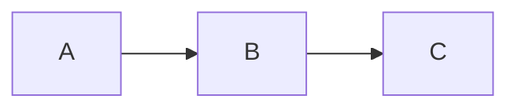

# Render Mermaid Option Implementation Plan

> **For Claude:** REQUIRED SUB-SKILL: Use superpowers:executing-plans to implement this plan task-by-task.

**Goal:** Add `--render-mermaid=plain|ascii` CLI flag to render mermaid code blocks as ASCII diagrams using the mermaid-ascii library.

**Architecture:** Preprocess markdown content before Glamour rendering. Scan for mermaid fenced code blocks and replace them with rendered ASCII diagrams when `--render-mermaid=ascii`. The preprocessor is called at both CLI and TUI render entry points.

**Tech Stack:** Go, github.com/AlexanderGrooff/mermaid-ascii, cobra/viper for flags

---

## Task 1: Add mermaid-ascii dependency

**Files:**
- Modify: `go.mod`

**Step 1: Add the dependency**

Run:
```bash
go get github.com/AlexanderGrooff/mermaid-ascii@latest
```

**Step 2: Verify dependency added**

Run:
```bash
go mod tidy
grep mermaid-ascii go.mod
```
Expected: Line containing `github.com/AlexanderGrooff/mermaid-ascii`

**Step 3: Commit**

```bash
git add go.mod go.sum
git commit -m "deps: add mermaid-ascii library for diagram rendering"
```

---

## Task 2: Create mermaid preprocessor with tests

**Files:**
- Create: `utils/mermaid.go`
- Create: `utils/mermaid_test.go`

**Step 1: Write failing tests for mermaid block detection and rendering**

Create `utils/mermaid_test.go`:

```go
package utils

import (
	"strings"
	"testing"
)

func TestRenderMermaidBlocks_PlainMode(t *testing.T) {
	input := "# Hello\n\n```mermaid\ngraph LR\nA --> B\n```\n\nMore text"
	result := RenderMermaidBlocks(input, "plain")
	if result != input {
		t.Errorf("plain mode should return input unchanged\ngot: %s\nwant: %s", result, input)
	}
}

func TestRenderMermaidBlocks_AsciiMode_SimpleGraph(t *testing.T) {
	input := "# Hello\n\n```mermaid\ngraph LR\nA --> B\n```\n\nMore text"
	result := RenderMermaidBlocks(input, "ascii")

	// Should not contain the original mermaid block
	if strings.Contains(result, "```mermaid") {
		t.Error("ascii mode should replace mermaid blocks")
	}
	// Should still have surrounding content
	if !strings.Contains(result, "# Hello") {
		t.Error("should preserve content before mermaid block")
	}
	if !strings.Contains(result, "More text") {
		t.Error("should preserve content after mermaid block")
	}
	// Should contain box-drawing characters (the rendered diagram)
	if !strings.Contains(result, "─") && !strings.Contains(result, "-") {
		t.Error("should contain rendered diagram with box characters")
	}
}

func TestRenderMermaidBlocks_MultipleMermaidBlocks(t *testing.T) {
	input := "```mermaid\ngraph LR\nA --> B\n```\n\nText\n\n```mermaid\ngraph TD\nC --> D\n```"
	result := RenderMermaidBlocks(input, "ascii")

	// Count occurrences of mermaid - should be zero
	if strings.Contains(result, "```mermaid") {
		t.Error("all mermaid blocks should be replaced")
	}
}

func TestRenderMermaidBlocks_NonMermaidCodeBlocks(t *testing.T) {
	input := "```go\nfunc main() {}\n```\n\n```mermaid\ngraph LR\nA --> B\n```"
	result := RenderMermaidBlocks(input, "ascii")

	// Go block should remain unchanged
	if !strings.Contains(result, "```go") {
		t.Error("non-mermaid code blocks should remain unchanged")
	}
	if !strings.Contains(result, "func main()") {
		t.Error("non-mermaid code block content should remain unchanged")
	}
}

func TestRenderMermaidBlocks_TildeFence(t *testing.T) {
	input := "~~~mermaid\ngraph LR\nA --> B\n~~~"
	result := RenderMermaidBlocks(input, "ascii")

	if strings.Contains(result, "~~~mermaid") {
		t.Error("tilde-fenced mermaid blocks should be replaced")
	}
}

func TestRenderMermaidBlocks_MermaidWithExtraInfo(t *testing.T) {
	// Some markdown processors allow extra info after language
	input := "```mermaid some-extra-info\ngraph LR\nA --> B\n```"
	result := RenderMermaidBlocks(input, "ascii")

	if strings.Contains(result, "```mermaid") {
		t.Error("mermaid blocks with extra info should be replaced")
	}
}

func TestRenderMermaidBlocks_InvalidMermaid_Fallback(t *testing.T) {
	// Invalid mermaid syntax should fall back to original with error comment
	input := "```mermaid\nthis is not valid mermaid syntax @@##$$\n```"
	result := RenderMermaidBlocks(input, "ascii")

	// Should have error comment at top
	if !strings.Contains(result, "<!-- mermaid render error:") {
		t.Error("invalid mermaid should include error comment")
	}
	// Should keep original block content
	if !strings.Contains(result, "```mermaid") || !strings.Contains(result, "this is not valid") {
		t.Error("invalid mermaid should fall back to original block")
	}
}

func TestRenderMermaidBlocks_SequenceDiagram(t *testing.T) {
	input := "```mermaid\nsequenceDiagram\nAlice->>Bob: Hello\n```"
	result := RenderMermaidBlocks(input, "ascii")

	if strings.Contains(result, "```mermaid") {
		t.Error("sequence diagrams should be rendered")
	}
	// Should contain participant names
	if !strings.Contains(result, "Alice") || !strings.Contains(result, "Bob") {
		t.Error("rendered sequence diagram should contain participant names")
	}
}

func TestRenderMermaidBlocks_EmptyContent(t *testing.T) {
	result := RenderMermaidBlocks("", "ascii")
	if result != "" {
		t.Error("empty input should return empty output")
	}
}

func TestRenderMermaidBlocks_NoMermaidBlocks(t *testing.T) {
	input := "# Just markdown\n\nNo mermaid here."
	result := RenderMermaidBlocks(input, "ascii")
	if result != input {
		t.Error("content without mermaid blocks should be unchanged")
	}
}

func TestRenderMermaidBlocks_NestedFence_ShouldNotRender(t *testing.T) {
	// Mermaid block inside another code block (e.g., markdown example) should NOT be rendered
	input := "````markdown\n```mermaid\ngraph LR\nA --> B\n```\n````"
	result := RenderMermaidBlocks(input, "ascii")

	// The inner mermaid block should remain unchanged
	if !strings.Contains(result, "```mermaid") {
		t.Error("mermaid block nested inside another fence should NOT be rendered")
	}
	if !strings.Contains(result, "graph LR") {
		t.Error("nested mermaid content should remain unchanged")
	}
}

func TestRenderMermaidBlocks_IndentedInList(t *testing.T) {
	// Mermaid block indented inside a list item
	input := "- Item\n  ```mermaid\n  graph LR\n  A --> B\n  ```"
	result := RenderMermaidBlocks(input, "ascii")

	// Should render but preserve indentation
	if strings.Contains(result, "```mermaid") {
		t.Error("indented mermaid block should be rendered")
	}
	// Result should have indented lines (list structure preserved)
	lines := strings.Split(result, "\n")
	foundIndented := false
	for _, line := range lines {
		if strings.HasPrefix(line, "  ") && strings.Contains(line, "─") {
			foundIndented = true
			break
		}
	}
	if !foundIndented {
		t.Error("rendered diagram should preserve list indentation")
	}
}

func TestRenderMermaidBlocks_CRLF(t *testing.T) {
	// Windows-style line endings
	input := "```mermaid\r\ngraph LR\r\nA --> B\r\n```\r\n"
	result := RenderMermaidBlocks(input, "ascii")

	if strings.Contains(result, "```mermaid") {
		t.Error("CRLF input should be handled correctly")
	}
}

func TestRenderMermaidBlocks_LongerClosingFence(t *testing.T) {
	// Closing fence can be longer than opening fence
	input := "```mermaid\ngraph LR\nA --> B\n`````"
	result := RenderMermaidBlocks(input, "ascii")

	if strings.Contains(result, "```mermaid") {
		t.Error("longer closing fence should be valid")
	}
}

func TestRenderMermaidBlocks_NoClosingFence(t *testing.T) {
	// Unclosed fence should be left unchanged
	input := "```mermaid\ngraph LR\nA --> B"
	result := RenderMermaidBlocks(input, "ascii")

	if result != input {
		t.Error("unclosed fence should be left unchanged")
	}
}

func TestRenderMermaidBlocks_CaseInsensitive(t *testing.T) {
	input := "```MERMAID\ngraph LR\nA --> B\n```"
	result := RenderMermaidBlocks(input, "ascii")

	if strings.Contains(result, "```MERMAID") {
		t.Error("MERMAID (uppercase) should be recognized")
	}
}
```

**Step 2: Run tests to verify they fail**

Run:
```bash
go test ./utils -run TestRenderMermaidBlocks -v
```
Expected: FAIL with "undefined: RenderMermaidBlocks"

**Step 3: Implement the mermaid preprocessor**

Create `utils/mermaid.go`:

```go
package utils

import (
	"fmt"
	"strings"

	mermaidcmd "github.com/AlexanderGrooff/mermaid-ascii/cmd"
)

// RenderMermaidBlocks processes markdown content and renders mermaid code blocks
// as ASCII diagrams when mode is "ascii". When mode is "plain", returns content unchanged.
func RenderMermaidBlocks(content string, mode string) string {
	if mode != "ascii" || content == "" {
		return content
	}

	return processMermaidBlocks(content)
}

// fencedBlock represents a parsed fenced code block.
type fencedBlock struct {
	startLine    int    // line index where block starts
	endLine      int    // line index where block ends (inclusive)
	fenceChar    rune   // '`' or '~'
	fenceLen     int    // length of fence (>= 3)
	indentPrefix string // leading whitespace (up to 3 spaces)
	infoString   string // language/info after fence
	content      string // content inside the block
}

// processMermaidBlocks uses a line-scanner to find and replace mermaid blocks.
// This correctly handles nested fences, indentation, and CRLF line endings.
func processMermaidBlocks(content string) string {
	// Normalize CRLF to LF for consistent processing
	content = strings.ReplaceAll(content, "\r\n", "\n")

	lines := strings.Split(content, "\n")
	blocks := findMermaidBlocks(lines)

	// Process blocks in reverse order to preserve line indices
	for i := len(blocks) - 1; i >= 0; i-- {
		block := blocks[i]
		rendered := renderMermaidBlock(block)
		lines = replaceLines(lines, block.startLine, block.endLine, rendered)
	}

	return strings.Join(lines, "\n")
}

// findMermaidBlocks scans lines and returns all top-level mermaid fenced blocks.
// Blocks nested inside other fenced blocks are ignored.
func findMermaidBlocks(lines []string) []fencedBlock {
	var blocks []fencedBlock
	var currentBlock *fencedBlock
	inFence := false
	var fenceChar rune
	var fenceLen int

	for i, line := range lines {
		// Check if this line is a fence
		indent, char, length, info := parseFenceLine(line)

		if !inFence {
			// Not currently in a fence - check for opening fence
			if length >= 3 {
				inFence = true
				fenceChar = char
				fenceLen = length

				// Check if this is a mermaid block (case-insensitive)
				infoToken := strings.Fields(info)
				if len(infoToken) > 0 && strings.EqualFold(infoToken[0], "mermaid") {
					currentBlock = &fencedBlock{
						startLine:    i,
						fenceChar:    char,
						fenceLen:     length,
						indentPrefix: indent,
						infoString:   info,
					}
				}
			}
		} else {
			// Currently in a fence - check for closing fence
			// Closing fence must use same char and length >= opening length
			if char == fenceChar && length >= fenceLen && strings.TrimSpace(info) == "" {
				if currentBlock != nil {
					// End of a mermaid block
					currentBlock.endLine = i
					// Extract content (lines between start and end)
					var contentLines []string
					for j := currentBlock.startLine + 1; j < i; j++ {
						// Remove the indent prefix from content lines
						contentLine := lines[j]
						if strings.HasPrefix(contentLine, currentBlock.indentPrefix) {
							contentLine = contentLine[len(currentBlock.indentPrefix):]
						}
						contentLines = append(contentLines, contentLine)
					}
					currentBlock.content = strings.Join(contentLines, "\n")
					blocks = append(blocks, *currentBlock)
					currentBlock = nil
				}
				inFence = false
				fenceChar = 0
				fenceLen = 0
			}
		}
	}

	return blocks
}

// parseFenceLine checks if a line is a fence line.
// Returns: indent prefix, fence char, fence length, info string.
// If not a fence line, returns length=0.
func parseFenceLine(line string) (indent string, char rune, length int, info string) {
	// Count leading spaces (up to 3 allowed for fenced code blocks)
	spaces := 0
	for _, c := range line {
		if c == ' ' && spaces < 3 {
			spaces++
		} else {
			break
		}
	}
	indent = line[:spaces]
	rest := line[spaces:]

	if len(rest) < 3 {
		return indent, 0, 0, ""
	}

	// Check for fence character
	firstChar := rune(rest[0])
	if firstChar != '`' && firstChar != '~' {
		return indent, 0, 0, ""
	}

	// Count consecutive fence characters
	fenceCount := 0
	for _, c := range rest {
		if c == firstChar {
			fenceCount++
		} else {
			break
		}
	}

	if fenceCount < 3 {
		return indent, 0, 0, ""
	}

	// Info string is everything after the fence chars
	info = strings.TrimSpace(rest[fenceCount:])

	// Backtick fences cannot have backticks in info string
	if firstChar == '`' && strings.Contains(info, "`") {
		return indent, 0, 0, ""
	}

	return indent, firstChar, fenceCount, info
}

// renderMermaidBlock renders a mermaid block to ASCII and returns replacement lines.
func renderMermaidBlock(block fencedBlock) []string {
	rendered, err := mermaidcmd.RenderDiagram(block.content, nil)
	if err != nil {
		// On error, add comment with error message and keep original block
		errComment := fmt.Sprintf("<!-- mermaid render error: %s -->", err.Error())
		var result []string
		result = append(result, block.indentPrefix+errComment)
		result = append(result, block.indentPrefix+strings.Repeat(string(block.fenceChar), block.fenceLen)+block.infoString)
		for _, line := range strings.Split(block.content, "\n") {
			result = append(result, block.indentPrefix+line)
		}
		result = append(result, block.indentPrefix+strings.Repeat(string(block.fenceChar), block.fenceLen))
		return result
	}

	// Wrap rendered output in a plain code block, preserving indentation
	rendered = strings.TrimRight(rendered, "\n\r\t ")
	var result []string
	result = append(result, block.indentPrefix+"```")
	for _, line := range strings.Split(rendered, "\n") {
		result = append(result, block.indentPrefix+line)
	}
	result = append(result, block.indentPrefix+"```")
	return result
}

// replaceLines replaces lines[start:end+1] with newLines.
func replaceLines(lines []string, start, end int, newLines []string) []string {
	result := make([]string, 0, len(lines)-end+start-1+len(newLines))
	result = append(result, lines[:start]...)
	result = append(result, newLines...)
	result = append(result, lines[end+1:]...)
	return result
}
```

**Step 4: Run tests to verify they pass**

Run:
```bash
go test ./utils -run TestRenderMermaidBlocks -v
```
Expected: All tests PASS

**Step 5: Commit**

```bash
git add utils/mermaid.go utils/mermaid_test.go
git commit -m "feat(utils): add mermaid block preprocessor for ASCII rendering"
```

---

## Task 3: Add CLI flag and wire into main.go

**Files:**
- Modify: `main.go`

**Step 1: Add test for the new flag**

Add to `glow_test.go`:

```go
func TestRenderMermaidFlag(t *testing.T) {
	tt := []struct {
		args     []string
		expected string
	}{
		{
			args:     []string{"--render-mermaid", "plain"},
			expected: "plain",
		},
		{
			args:     []string{"--render-mermaid", "ascii"},
			expected: "ascii",
		},
	}

	for _, v := range tt {
		err := rootCmd.ParseFlags(v.args)
		if err != nil {
			t.Fatal(err)
		}
		if renderMermaid != v.expected {
			t.Errorf("Parsing --render-mermaid failed: got %s, want %s", renderMermaid, v.expected)
		}
	}
}
```

**Step 2: Run test to verify it fails**

Run:
```bash
go test -run TestRenderMermaidFlag -v
```
Expected: FAIL with "undefined: renderMermaid"

**Step 3: Add the flag variable and flag definition**

In `main.go`, add to the var block (around line 44):

```go
var (
	// ... existing vars ...
	renderMermaid    string
)
```

In `init()` function, add after line 405 (after the mouse flag):

```go
	rootCmd.Flags().StringVar(&renderMermaid, "render-mermaid", "plain", "render mermaid diagrams: plain (default) or ascii")
```

Add viper binding after line 417:

```go
	_ = viper.BindPFlag("renderMermaid", rootCmd.Flags().Lookup("render-mermaid"))
```

Add viper default after line 421:

```go
	viper.SetDefault("renderMermaid", "plain")
```

**Step 4: Add validation in validateOptions**

In `validateOptions()`, add after line 173 (after preserveNewLines):

```go
	renderMermaid = viper.GetString("renderMermaid")
	if renderMermaid != "plain" && renderMermaid != "ascii" {
		return fmt.Errorf("invalid --render-mermaid value: %s (must be plain or ascii)", renderMermaid)
	}
```

**Step 5: Wire preprocessor into executeCLI**

In `executeCLI()`, modify the rendering section. After line 307 (`content = utils.WrapCodeBlock(...)`) and before line 309 (`out, err := r.Render(content)`), add:

```go
	// Preprocess mermaid blocks if rendering a markdown file
	if !isCode {
		content = utils.RenderMermaidBlocks(content, renderMermaid)
	}
```

**Step 6: Run test to verify it passes**

Run:
```bash
go test -run TestRenderMermaidFlag -v
```
Expected: PASS

**Step 7: Build and manual test**

Run:
```bash
go build -o glow-test .
echo '# Test


' | ./glow-test --render-mermaid=ascii -
```
Expected: Should show ASCII diagram instead of mermaid code

**Step 8: Commit**

```bash
git add main.go glow_test.go
git commit -m "feat: add --render-mermaid flag for ASCII diagram rendering"
```

---

## Task 4: Wire into TUI rendering

**Files:**
- Modify: `ui/config.go`
- Modify: `ui/pager.go`
- Modify: `main.go`

**Step 1: Add RenderMermaid to Config**

In `ui/config.go`, add field to Config struct (after line 12):

```go
	RenderMermaid    string
```

**Step 2: Pass config value in runTUI**

In `main.go`, in `runTUI()` function, add after line 361 (`cfg.PreserveNewLines = preserveNewLines`):

```go
	cfg.RenderMermaid = renderMermaid
```

**Step 3: Use preprocessor in glamourRender**

In `ui/pager.go`, add import for utils at the top:

```go
	"github.com/charmbracelet/glow/v2/utils"
```

In `glamourRender()` function, after line 450 (after the `if isCode { markdown = utils.WrapCodeBlock(...) }` block) and before line 452 (`out, err := r.Render(markdown)`), add:

```go
	// Preprocess mermaid blocks if rendering a markdown file
	if !isCode {
		markdown = utils.RenderMermaidBlocks(markdown, m.common.cfg.RenderMermaid)
	}
```

**Step 4: Build and test TUI mode**

Run:
```bash
go build -o glow-test .
```

Create a test file:
```bash
cat > /tmp/test-mermaid.md << 'EOF'
# Mermaid Test


## More content
EOF
```

Test TUI mode:
```bash
./glow-test --render-mermaid=ascii -t /tmp/test-mermaid.md
```
Expected: TUI shows ASCII diagram

**Step 5: Commit**

```bash
git add ui/config.go ui/pager.go main.go
git commit -m "feat(ui): wire mermaid rendering into TUI mode"
```

---

## Task 5: Final verification and cleanup

**Step 1: Run all tests**

Run:
```bash
go test ./...
```
Expected: All tests PASS

**Step 2: Run linter**

Run:
```bash
golangci-lint run
```
Expected: No errors

**Step 3: Build release binary**

Run:
```bash
go build .
```
Expected: Success

**Step 4: End-to-end test matrix**

Test these scenarios:

| Command | Expected |
|---------|----------|
| `echo '```mermaid\ngraph LR\nA-->B\n```' \| ./glow -` | Shows mermaid code block |
| `echo '```mermaid\ngraph LR\nA-->B\n```' \| ./glow --render-mermaid=plain -` | Shows mermaid code block |
| `echo '```mermaid\ngraph LR\nA-->B\n```' \| ./glow --render-mermaid=ascii -` | Shows ASCII diagram |
| `./glow --render-mermaid=invalid -` | Error: invalid value |

**Step 5: Final commit if needed**

```bash
git status
# If any uncommitted changes:
git add -A
git commit -m "chore: final cleanup for render-mermaid feature"
```

---

## Summary

| Task | Description | Files |
|------|-------------|-------|
| 1 | Add mermaid-ascii dependency | go.mod, go.sum |
| 2 | Create mermaid preprocessor (line-scanner, handles nested fences, indentation, CRLF, error fallback with comment) | utils/mermaid.go, utils/mermaid_test.go |
| 3 | Add CLI flag | main.go, glow_test.go |
| 4 | Wire into TUI | ui/config.go, ui/pager.go, main.go |
| 5 | Final verification | - |

## Key Design Decisions

1. **Line-scanner instead of regex**: Correctly handles nested fences, indentation, CRLF, and CommonMark fence rules
2. **Error handling**: On invalid mermaid, adds `<!-- mermaid render error: ... -->` comment before the original block
3. **Indentation preservation**: Maintains list/blockquote context by preserving indent prefix
4. **Nested fence protection**: Mermaid blocks inside other code blocks are NOT rendered (important for documentation)
